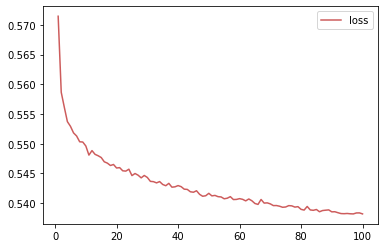
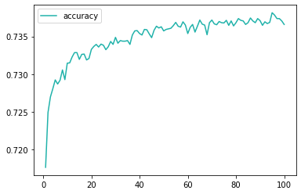
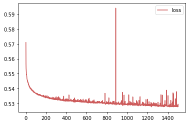
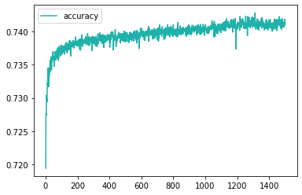
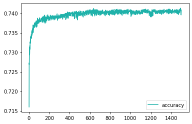

# Deep Learning - Charity Funding Predictor

       ) ))
      ( ((  /)
     ,-===-//
    |`-===-'|
    '       '
     \_____/
     `-----'

__________________

 Tools, Languages, & Libraries Utilized

<li>Python</li>
<li>Pandas</li>
<li>TensorFlow</li>
<li>Sklearn</li>
<li>VS Code</li>
<li>Jupyter Notebook</li>

__________________

	 
A binary classifier that is capable of predicting whether applicants will be successful if funded.

### Review the analysis here:

<a href="https://github.com/rb25s13/deep-learning-charity-funding-predictor/blob/main/analysis.md">https://github.com/rb25s13/deep-learning-charity-funding-predictor/blob/main/analysis.md</a>

### Overview:
The purpose of this analysis is to show what was done for the algorithm to achieve the results stated below. This is an attempt to create a binary classifier that can predict whethor or not the charity funding will be successful.

### Model w/o optimization:

 

### Model 1 w/ optimization:
   
  
  	model w/ opt1 - 0.7383 - 3 layers: 80, 30, 10 - activation='relu' - epochs=1500 (less features)

### Model 2 w/ optimization:
   
  
  	model w/ opt2 - 0.7328 - 3 layers: 80, 30, 10 - activation='selu' - epochs=500 (less features than opt1)

### Model 3 w/ optimization:
   
  
  	model w/ opt3 - 0.7392 - 3 layers: 160, 60, 20 - activation='relu' - epochs=1500 (doubled nodes from opt1)
