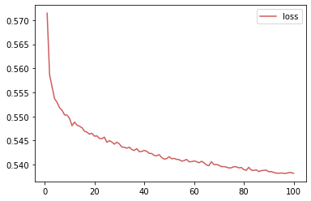
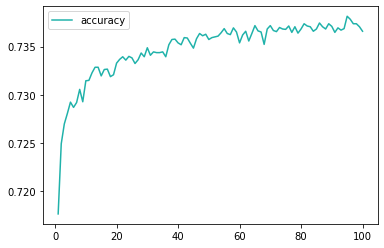
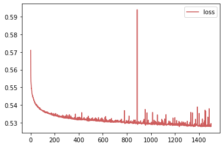
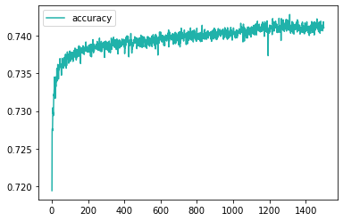
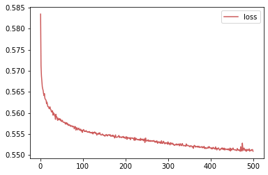
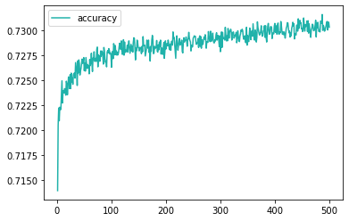
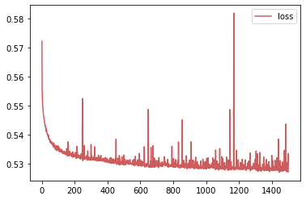
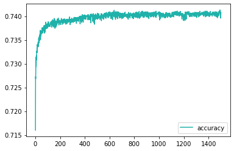

# Charity Funding Predictor Analysis

       ) ))
      ( ((  /)
     ,-===-//
    |`-===-'|
    '       '
     \_____/
     `-----'

### Overview:
The purpose of this analysis is to show what was done for the algorithm to achieve the results stated below. This is an attempt to create a binary classifier that can predict whethor or not the charity funding will be successful.

### Baseline Graphs:

 

		model w/o opt - 0.7375 - 2 layers: 80, 30 - activation='relu' - epochs=100

  
<strong>Model Optimization Graphs</strong>

### Model 1
   
  
  		model w/ opt1 - 0.7383 - 3 layers: 80, 30, 10 - activation='relu' - epochs=1500 (less features)

### Model 2
   
  
  		model w/ opt2 - 0.7328 - 3 layers: 80, 30, 10 - activation='selu' - epochs=500 (less features than opt1)

### Model 3
   
  
  		model w/ opt3 - 0.7392 - 3 layers: 160, 60, 20 - activation='relu' - epochs=1500 (doubled nodes from opt1)

	

### Results:

  
<strong>Data Preprocessing</strong>

  
    What variable(s) are considered the target(s) for your model? 
	
		I used the IS_SUCCESSFUL column as my target for the models.
	
    What variable(s) are considered to be the features for your model? 
	
		I used the CLASSIFICATION, APPLICATION_TYPE columns for the features on the models.
	
    What variable(s) are neither targets nor features, and should be removed from the input data? 
	
		'EIN', 'NAME' are should be removed from the input data because they are are neither targets nor features.

	

  
<strong>Compiling, Training, and Evaluating the Model</strong>

  
    How many neurons, layers, and activation functions did you select for your neural network model, and why?
	
		I used the baseline model numbers because it was close to the number of features initially used. I then made small tweaks to see the differences.
		
		model w/o opt - 0.7375 - 2 layers: 80, 30 - activation='relu' - epochs=100
		
		model w/ opt1 - 0.7383 - 3 layers: 80, 30, 10 - activation='relu' - epochs=1500 (less features)
		
		model w/ opt2 - 0.7328 - 3 layers: 80, 30, 10 - activation='selu' - epochs=500 (less features than opt1)
		
		model w/ opt3 - 0.7392 - 3 layers: 160, 60, 20 - activation='relu' - epochs=1500 (doubled nodes from opt1)
		
    Were you able to achieve the target model performance?
	
		No, with multiple attempts, I could not get the accuracy above 74%. With more time, I believe I could get the desired results.
	
    What steps did you take to try and increase model performance?
	
		I tried decreasing the amount of features, increasing the number of epochs, different activation types, and increased the number of nodes.

	
	
### Summary:

It is clear in our graphs how the modifications change the results of the models. The loss and accuracy seem to be relational barring a few outliers. With more data or possible tweaks with current data, we could generate more models to achieve the score we are lloking for. I would attempt to add more layers, increase the number of nodes, and add a large number of epochs in order to achieve a higher accuracy score.

I am basing this recommendation off of the three models that were optimized and how they appear to react to the tweaks.